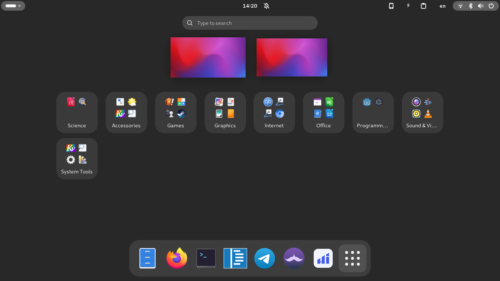

# App Grid Wizard - GNOME Extension

**App Grid Wizard** is a GNOME Shell extension that simplifies organizing your applications into predefined categories in the app grid. With a single click, it automatically groups your apps into folders like "Accessories," "Games," "Graphics," "Internet," and more. It also monitors app installations and updates to keep your app grid organized.



---

## Features

- **One-Click Organization**: Automatically organizes apps into predefined folders based on their categories.
- **Dynamic Monitoring**: Monitors app installations and updates to keep your app grid organized.
- **Customizable Folders**: Predefined folders for common app categories like "Games," "Office," "Programming," and more.
- **Quick Settings Toggle**: Easily enable or disable the extension from the GNOME Quick Settings menu.
- **Lightweight**: Minimal impact on system performance.

---

## Installation

### From extensions.gnome.org
1. Visit the [App Grid Wizard page on extensions.gnome.org](https://extensions.gnome.org/extension/7867/app-grid-wizard/).
2. Click the toggle switch to install the extension.
3. Enable the extension using GNOME Extensions or the `Extensions` app.

### Manual Installation
1. Clone this repository or download the source code:
   ```bash
   git clone https://github.com/MahdiMirzade/app-grid-wizard.git
   ```
2. Move the extension folder to `~/.local/share/gnome-shell/extensions/`:
   ```bash
   mv app-grid-wizard ~/.local/share/gnome-shell/extensions/app-grid-wizard@mirzadeh.pro
   ```
3. Restart GNOME Shell by pressing `Alt + F2`, typing `r`, and pressing `Enter`. (You'll need to log out if you're using wayland)
4. Enable the extension using GNOME Extensions or the `Extensions` app.

---

## Usage

1. Open the GNOME Quick Settings menu by clicking the system menu in the top-right corner.
2. Click the **App Grid Wizard** toggle to enable or disable the extension.
3. When enabled, your apps will be automatically organized into folders in the app grid.
4. The extension will monitor app installations and updates to keep your app grid organized.

---

## Supported Folders

The extension organizes apps into the following folders:

| Folder Name         | Categories Included                          |
|----------------------|---------------------------------------------|
| Accessories          | Utility                                     |
| Chrome Apps          | Chrome Apps                                 |
| Games                | Game                                        |
| Graphics             | Graphics                                    |
| Internet             | Network, WebBrowser, Email                  |
| Office               | Office                                      |
| Programming          | Development                                 |
| Science              | Science                                     |
| Sound & Video        | AudioVideo, Audio, Video                    |
| System Tools         | System, Settings                            |
| Universal Access     | Accessibility                               |
| Wine                 | Wine, X-Wine, Wine-Programs-Accessories     |
| Waydroid             | Waydroid, X-WayDroid-App                    |

---

## Contributing

Contributions are welcome! If you'd like to contribute to the development of App Grid Wizard, follow these steps:

1. Fork the repository.
2. Create a new branch for your feature or bugfix.
3. Commit your changes and push to your fork.
4. Submit a pull request.

---

## License

This project is licensed under the **GNU General Public License v3.0**. See the [LICENSE](LICENSE) file for details.

---

## Acknowledgments

- GNOME Shell and GNOME Extensions for providing the platform.
- The GNOME community for their support and inspiration.

---

## Feedback and Support

If you encounter any issues or have suggestions for improvement, please [open an issue](https://github.com/MahdiMirzade/app-grid-wizard/issues) on GitHub.

Enjoy a cleaner and more organized app grid with **App Grid Wizard**!
